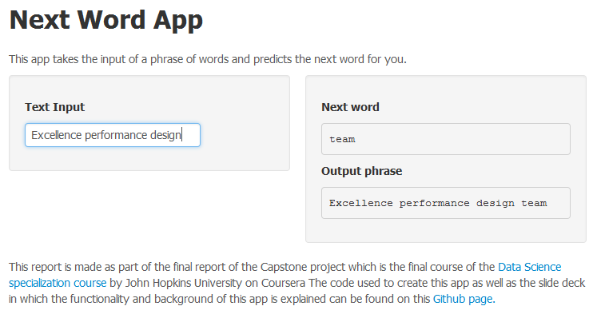

Next Word Predicting
========================================================
id: slide 1
author: Daan Hoevers
date: 23 August 2015
width: 1440
height: 900

#### Interactively predicting the next word of a phrase

A shiny app developed for the Capstone Project course as part of the [Data Science Specialization](https://www.coursera.org/specialization/jhudatascience/1?utm_medium=listingPage) by John Hopkins University on Coursera. 

<small> RStudio Presenter code of this pitch and R Code of this project is available on [Github](https://github.com/DaanHoevers/Capstone_Project/tree/master/02_Final_Project) </small>

======================
id: slide2
title: false

### How to Use the Next Word App
<small> The objective of the *Next Word App* is to predict the next word for the user based on a phrase provided. To maximize the user experience, the User Interface of the *Next Word App* is made as user friendly as possible. 
* The user can start entering a phrase and the *Next Word App* will predict the next word while the user is entering the words. In addition the phrase entered together with the next word is provided. 
* Since the concept of [reactive programming](https://en.wikipedia.org/wiki/Reactive_programming) is used the output is automatically updated as the user provides new values.
* See below screenshot of the user interface with an input text box and 2 output text boxes:</small>

========================================================
id: slide3
title: false

### Next Word App Algorithm
<small>The following algorithms and methods are used to create the predicting model used in the *Next Word App*:

1. From the data corpus provided by [HC Corpora](www.corpora.heliohost.org) only the English twitter, blog and news data sources are used to create a random 1% sample containing 23601 lines.
2. The sample is used to create uni, bi, tri, and quad [n-grams](https://en.wikipedia.org/wiki/N-gram) and subsequently frequency tables for each n-gram.
3. In order to *re-estimate the amount of probability mass to assign to Ngrams with low counts by looking at the number of Ngrams of higher counts* ([source](http://l2r.cs.uiuc.edu/~danr/Teaching/CS546-09/Lectures/Lec5-Stat-09-ext.pdf)), the **Simple Good Turing** smoothing method was applied based on this [paper](http://l2r.cs.uiuc.edu/~danr/Teaching/CS546-09/Lectures/Lec5-Stat-09-ext.pdf). 
4. The propabilities obtained were used in a simple [Back Off Model](https://en.wikipedia.org/wiki/Katz%27s_back-off_model). Of each phrase provided, the *n-1, n-2, n-3* words are obtained. The *n-1*, *n-2* and *n-3* word are used to determine whether the combination is present in the quadgram and the *n* word is returned. If not the *n-1* and *n-2* words are used to back off to the trigram and next the *n-1* word is used against the bigram. 
5. In case for a certain word combination appears more than once in any ngram, the unigram is used to determine the most frequent *n* word.
6. When no match is found based on the phrase provided, the most frequent unigram word is returned.

R Code: [Step 1](https://github.com/DaanHoevers/Capstone_Project/blob/master/02_Final_Project/Sample_Creation.R), [Step 2](https://github.com/DaanHoevers/Capstone_Project/blob/master/02_Final_Project/Create_Data_Files_App.R), [Step 3](https://github.com/DaanHoevers/Capstone_Project/blob/master/02_Final_Project/Simple_Good_Turing.R), [Step 4, 5 and 6](https://github.com/DaanHoevers/Capstone_Project/blob/master/02_Final_Project/inputPreparation.R)
</small>

========================================================
id: slide4
title: false

### Next Word App Design Decisions

<small> The following design decisions has been taken during the design of the *Next Word App* keeping in mind the balance between accuracy and usability of the app:

* In the Milestone report investigation it was concluded  that in a sample of 0,1% order to cover a 50% of the word instance a relative small amount of words was required. Hence, a sample of 1% seems to suffice.
* Although in the Milestone report it was concluded that quadgrams are very corpus specific and do not add additional value over trigrams, quadgrams are included in this model. The reason is due to the back off model usage they do add value for the purpose of predicting the next word.
* It was also decided to not remove the stopswords from the corpus. Stopwords are used frequently in our language, hence for the purpose of predicting the next word stopwords are considered useful.
* In order to bring down the size of the data used when publishing the *Next Word App* at the Shiny App server, the singletons and ngrams with a frequency of 2 are removed from the ngrams data files ([source](https://class.coursera.org/nlp/lecture/19)).
* To maximize the user experience and omit an action button, reactive programming is used. For more information, please visit this [Shiny Tutorial](http://shiny.rstudio.com/tutorial/lesson6/#stq=&stp=0).</small>

========================================================
id: slide5
title: false

### Next Word App Performance
<small> The *Next Word App* has an execellent balance between speed and accuracy

**Speed**
The app loads the functions, data tables in rData and provides the first prediction in 2.77 seconds locally. Due to the reactive capabilities, the user experience almost no waiting time on the next word when the phrase is extended.

**Accuracy**
The following table provides an illustration of the accuracy of the prediction model. It concerns 2 questions from the Capstone Project quizes with the "correct" and the *Next Word App* result.

|Phrase            |Correct_Answer |Result_Next_Word |
|:-----------------|:--------------|:----------------|
|It would mean the |world          |following        |
|to settle the     |matter         |day              |

The 2 results are not in line with the correct answer, but when searching on the exact phrase "to settle the matter" **5,770,000** results where found on Google while for the phrase "to settle the day" **7,770,000** results were found. Which could be an indication that the result of the *Next Word App* might even be a better prediction than the answer from the quiz.</small> 
